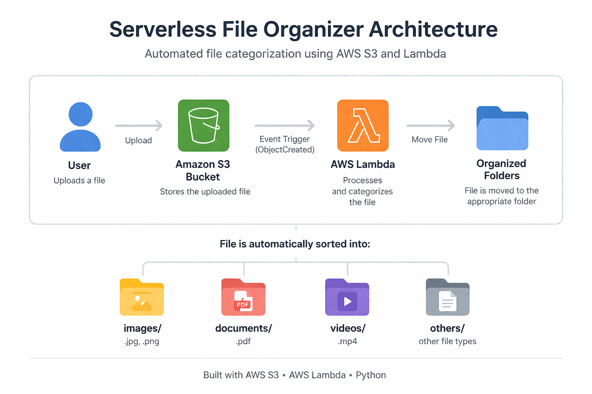

# Serverless File Organizer using AWS S3 and Lambda

## 📌 Overview

This project demonstrates an **event-driven serverless architecture** using AWS services.
Whenever a file is uploaded to an Amazon S3 bucket, an AWS Lambda function is automatically triggered to categorize and move the file into appropriate folders based on its type.

---

## 🏗️ Architecture

User uploads file → S3 Bucket → Lambda Trigger → File organized into folders

---

## ⚙️ How It Works

1. User uploads a file to S3 bucket
2. S3 triggers Lambda function (ObjectCreated event)
3. Lambda reads file name and detects type
4. File is moved to:

   * `images/`
   * `documents/`
   * `videos/`
   * `others/`
5. Loop prevention ensures no re-triggering

---

## 🚀 Features

* Event-driven automation
* Automatic file categorization
* Loop prevention logic
* Scalable serverless architecture

---

## 🛠️ Technologies Used

* AWS S3
* AWS Lambda (Python)
* IAM Roles & Policies
* CloudWatch Logs

---

## 📂 File Categorization

| File Type  | Destination Folder |
| ---------- | ------------------ |
| .jpg, .png | images/            |
| .pdf       | documents/         |
| .mp4       | videos/            |
| others     | others/            |

---

## ⚠️ Challenges Faced

* Handling S3 folder vs object behavior
* Preventing infinite Lambda execution loops
* Correct IAM role configuration

---

## 📸 Output

Files are automatically moved into respective folders after upload.

---

## 🔮 Future Improvements

* Add timestamp-based file renaming
* Store metadata in DynamoDB
* Build frontend upload interface

---

## 👨‍💻 Author

Jai Dev

